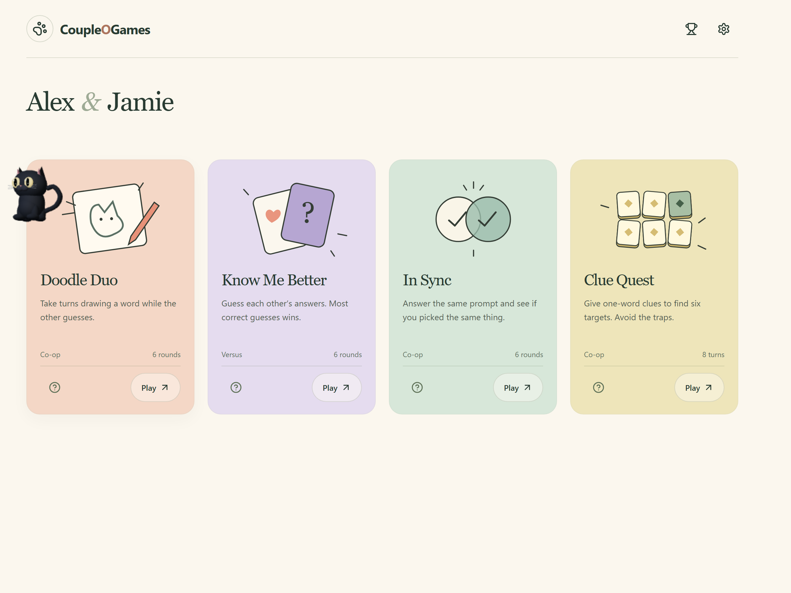
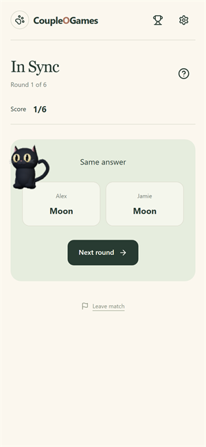
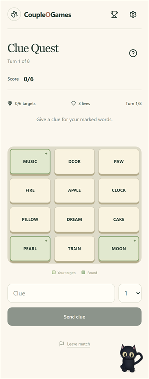

# CoupleOGames

CoupleOGames is for couples who want something to do together on their phones, especially when they're spending time apart. It gives you a small shared activity for the end of a day: draw something badly, guess what your partner would pick, or find out whether the same question sends you both to the same answer.

## Why make this for couples?

Knowing the other person is part of the game. A clue can make sense because of a conversation you had yesterday. A preference you were sure about can turn out to be wrong. An awful drawing can still be obvious to the one person who knows what you meant. Those are the moments this table is built for.

The questions stay with playful preferences. Guessing wrong gives you something to talk about; it doesn't produce a verdict on your relationship.

## What that changes

**A table for the same two people.** You arrive at your names and four games. There's no public lobby or search for an opponent. Your results stay on your shared scorecard, so the next visit picks up a little of the last one.

**More chances to win together.** Three of the four games are cooperative. Know Me Better adds a bit of rivalry, but the scorecard keeps personal wins separate from the games you won as a pair.

**Room for the reaction.** Answers stay hidden until it's time to reveal them. Both people choose when to move on after a reveal, so there's time for “you picked that too?” or an explanation. You also both agree before starting or leaving a game.

**Small enough for an ordinary evening.** Games have six rounds or a short clue board. The phone layout lets each of you play from your own screen. If a connection drops, play pauses, including the drawing countdown, and resumes when you're both back.

**A little company at the table.** The black cat wanders between game cards and reacts to results. Tap it for rules. It gives the space some character without asking either person to manage another thing; you can switch off its animation when you prefer a quieter screen.

## Pick what you're in the mood for

- **Doodle Duo:** Draw a secret word for your partner to guess. You take turns, and the score belongs to both of you.
- **Know Me Better:** Guess each other's preferences. Each person gets the same number of chances to prove how well they know the other.
- **In Sync:** Answer a prompt separately, then compare. Matching is the goal, but different answers can be the more interesting part.
- **Clue Quest:** Help each other find words using one-word clues. A shared reference might do more work than the obvious dictionary connection.

## A look around

The table opens with your names and a choice of games.

In Sync gives both answers their moment on the same screen.

In Clue Quest, you each know something the other needs. Take turns making it make sense.

